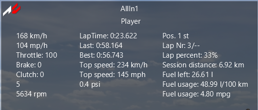

# InOne Project

## Overview
The InOne app for Assetto Corsa is a racing telemetry display that provides real-time information about the car's performance, fuel consumption, lap times, and more. It displays key metrics during a race or practice session, offering the driver useful data such as speed, gear, RPM, fuel levels, and lap times on an easy-to-read interface.

The app is written in Python and integrates with Assetto Corsa's Python API, making it highly customizable and extendable for various telemetry requirements.



## Features
- **Speed**: Displays the current speed in both kilometers per hour (km/h) and miles per hour (mph).
- **Car Inputs**: Shows accelerator, brake, and clutch positions, with values displayed as percentages.
- **Gear**: Displays the current gear of the car. The gear is shown in neutral ("N") or reverse ("R") if applicable.
- **RPM**: Shows the current RPM (Revolutions Per Minute) of the engine.
- **Fuel**: Displays the remaining fuel in liters and calculates the fuel usage rate in both liters per 100 km and miles per gallon (mpg).
- **Turbo Boost**: Shows the current turbo boost in PSI.
- **Lap Times**: Displays the last lap time, best lap time, and the current lap time.
- **Position and Progress**: Displays the current position in the race, lap percentage, and the number of completed laps.
- **Top Speed**: Tracks and displays the highest speed reached during the session in both km/h and mph.

## Installation
1. Clone the repository into your `apps/python` directory inside the Assetto Corsa installation folder:

    ```bash
    git clone https://github.com/your_username/InOne.git
    ```

2. Make sure that you have **Python 2.7.x** installed (required by Assetto Corsa for Python scripting).

3. Navigate to the Assetto Corsa directory and place the app's files inside the `apps/python/InOne` directory.

4. Run the game and enable the app from the Assetto Corsa interface by navigating to the **Apps** menu and selecting **InOne**.

## Code Explanation
The script is structured to read real-time data from Assetto Corsa through its Python API and update various labels with the corresponding information.

### Key Variables
- `l_kmh, l_mph`: Labels displaying speed in km/h and mph.
- `l_driver_name`: Displays the driver's name.
- `l_accelerator, l_brake, l_clutch`: Labels showing the throttle, brake, and clutch inputs.
- `l_gear`: Displays the current gear, with special handling for neutral and reverse.
- `l_rpm`: Shows the current RPM of the engine.
- `l_current_fuel`: Displays the remaining fuel in liters.
- `l_performance_meter`: Tracks the total distance traveled.
- `l_turbo_boost`: Displays the current turbo boost in PSI.
- `l_top_speed_kmh, l_top_speed_mph`: Tracks the highest speed reached in km/h and mph.
- `l_lastlap, l_bestlap, l_laptime`: Displays lap times, including the last lap, best lap, and current lap time.
- `l_position`: Displays the current race position.
- `l_completedLaps`: Shows the number of completed laps.
- `l_fuel_per_100km, l_fuel_per_mile`: Displays fuel consumption rates.

### Functions
- **acMain**: This function is called when the app is initialized. It creates and positions all the necessary UI elements on the screen.
- **acUpdate**: This function is called every frame to update the displayed data in real time. It reads the telemetry data from Assetto Corsa, calculates values such as fuel usage and lap times, and updates the labels accordingly.

## System Requirements
- Assetto Corsa installed with the Python API enabled.
- Python 2.7.x (used by Assetto Corsa for scripting).
- The app works on both 64-bit and 32-bit systems.

## Usage
Once installed, simply start a session in Assetto Corsa and open the InOne app from the in-game menu. The app will automatically update with relevant telemetry data during the session, including speed, fuel, lap times, and more.

### Key Bindings
The app updates automatically with each frame, so no key bindings are necessary.

## Customization
Feel free to modify the script for your needs. For instance:
- You can adjust the layout by modifying the coordinates of the labels (`pos_x`, `pos_y`).
- You can add or remove metrics as needed by editing the `acUpdate` function.
- You can also customize the appearance (e.g., font color, size) and logic for displaying values.

## Troubleshooting
- If the app does not appear, ensure you have placed the app's files in the correct directory (`apps/python/InOne`).
- Make sure Python 2.7.x is installed and configured correctly in Assetto Corsa.

## License
This project is licensed under the **MIT License**.

## Credits
- **Assetto Corsa Python API** [Link](https://www.assettocorsa.net/)
- **InOne telemetry app** by [Your Name/Username]

Feel free to reach out for any help or contributions!
